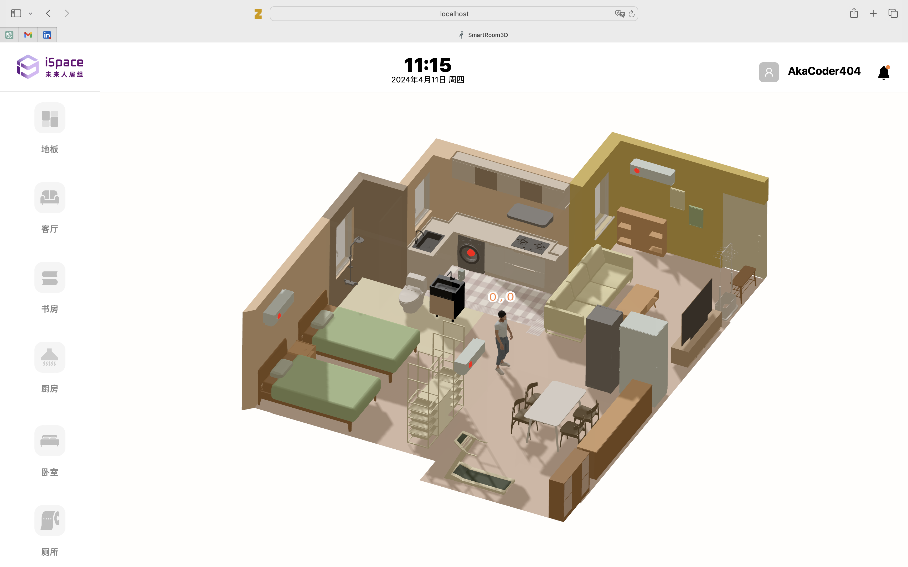
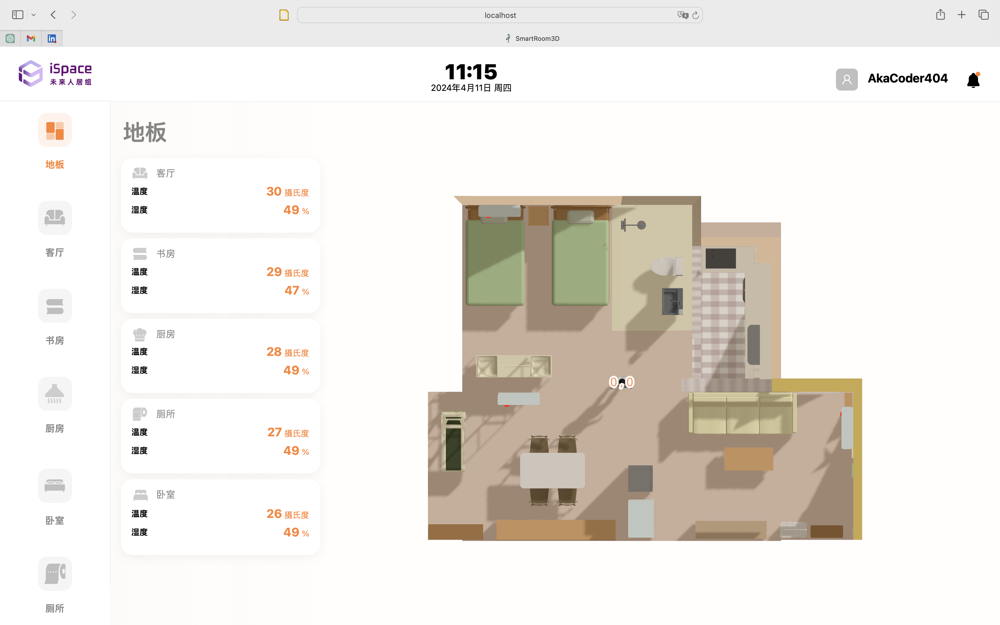
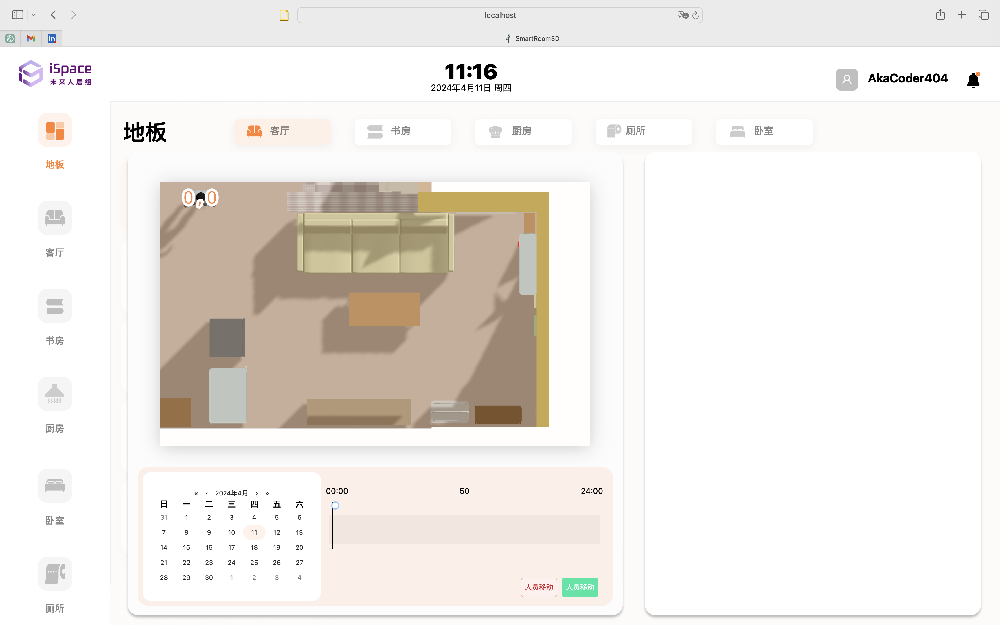
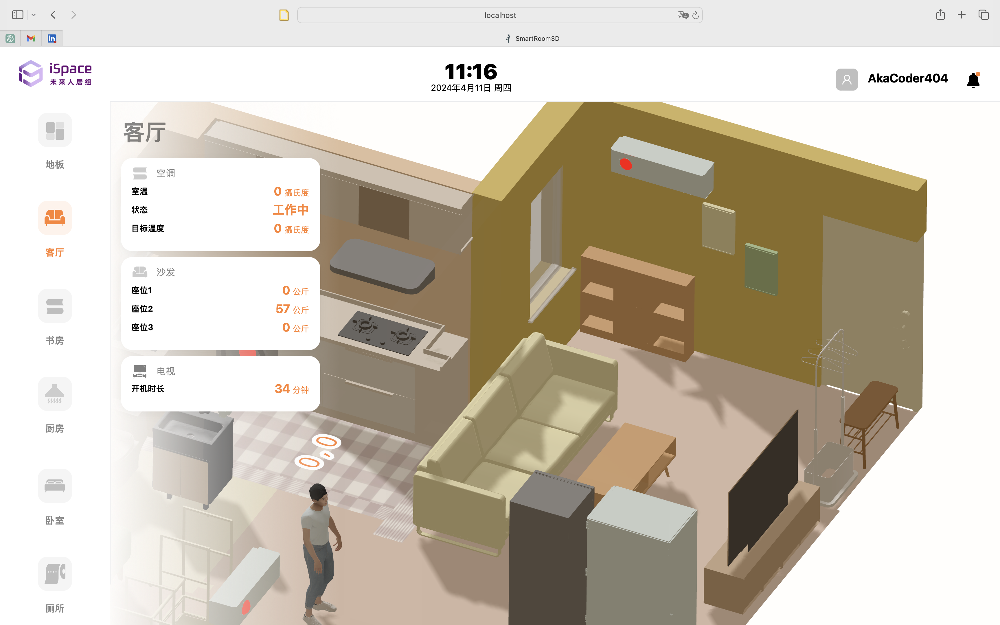
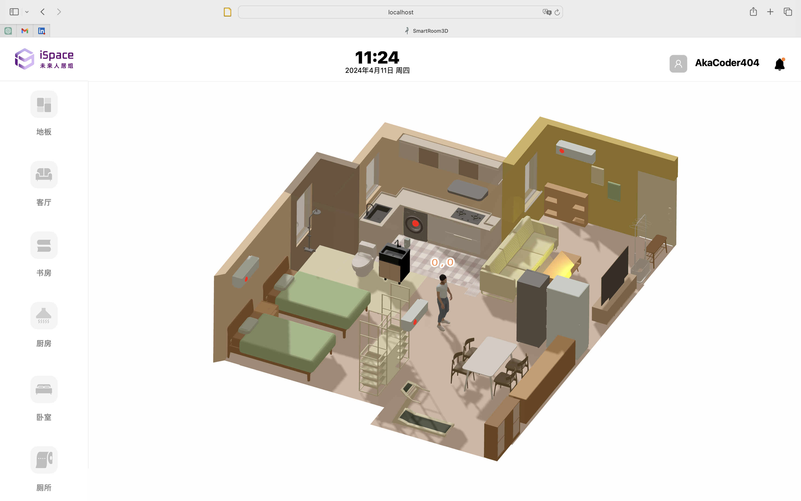

# SmartHome3D
A smart home visualizing application built using react and three.js.

## Background
Traditional homes are now becoming embued with IoT smart technology. This is a platform that can help visiualize the smart home activities. It is powered by three.js to build a 3D representation of the house and the smart devices. 

The 3D representation will reflect and display changes in the smart home, for example, smart floor tracking to track individual movement, TV usage, air conditioning usage. 

## Running
1. `npm install` to install dependencies
2. `npm run start` to start development server
3. `npm run build` to create production build

## UI
Here are some screenshots of the user interface.

### Default View

### Top Down View of Entire Floor

### Specific Top Down View of Living Room

### Specific View of Living Room

### Smart Device on-off Switch (TV)

## Functionality
- Three.js
- Localization (language switching support)